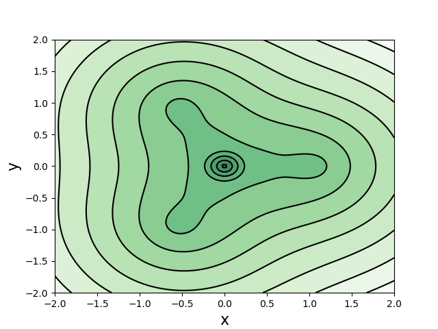
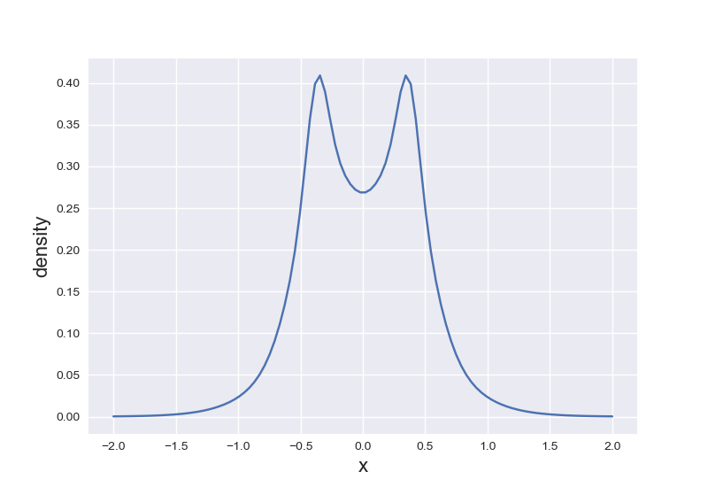

## 电子密度
在空间$\mathbf{r}$处找到任意一个电子的概率。

$$ \rho(\mathbf{r}) =  N \int |\Psi(\mathbf{x}_1, \mathbf{x}_2,\ldots,\mathbf{x}_N)|^2\, d\omega_1 d\mathbf{x}_2\ldots\mathbf{x}_N $$

将上式展开为空间轨道（分子轨道）$\{\psi_a\}$，为

$$ \rho(\mathbf{r}) = 2 \sum\limits_a^{N/2} |\psi_a(\mathbf{r})|^2 $$

若是自然轨道，则为

$$ \rho(\mathbf{r}) = \sum\limits_a^{N/2} \lambda_a |\eta_a(\mathbf{r})|^2 $$

其中$\eta_a$是自然轨道，$\lambda$是自然轨道占据数。

实际计算中将用一组基函数将轨道展开，则密度的表达式可写为

$$ \rho(\mathbf{r}) = \sum\limits_a^{N/2} \lambda_a \left| \sum\limits_i C_{ai} \varphi_i(\mathbf{r}) \right|^2 $$

$C_{ai}$是展开系数，$\lambda_a$对于分子轨道就是$2$，对于自然轨道则是非整数。

基函数同样可以用一组Gaussian型函数（Gaussian Type Function，GTF）展开:

$$ \varphi = \sum\limits_i a_i \chi_i^\text{GTF}(x,y,z) $$

$a_i$是收缩系数，$\chi^\text{GTF}$假定是Cartesian型GTF，有如下形式

$$ \chi = N x^{l_x} y^{l_y} z^{l_z} \mathrm{e}^{-\zeta r^2} $$

归一化系数$N$的表达式为

$$ \begin{aligned} N &= \left( \frac{2\zeta}{\pi} \right)^{3/4} \left[ \frac{(4\zeta)^{l_x+l_y+l_z}}{(2l_x-1)!!(2l_y-1)!!(2l_z-1)!!} \right]^{1/2} \\ &= \left( \frac{2\zeta}{\pi} \right)^{3/4} \left[ \frac{(8\zeta)^{l_x+l_y+l_z}l_x!l_y!l_z!}{(2l_x)!(2l_y)!(2l_z)!} \right]^{1/2} \end{aligned} $$

## 需要从.fch文件读取的量
波函数类型
> 如果是自然轨道，需要手动将`.fch`文件第一行内容改为`isNO`；  
从第二行确定波函数为`R`、`U`、`RO`。若使用的方法首字母为O，且为闭壳层的情况，会误认为波函数为`RO`，虽然并不影响密度的计算。  
`SP        RB3LYP                                                      6-31G(d,p)`    

电子数
> `Number of electrons                        I               10`  
`Number of alpha electrons                  I                5`  
`Number of beta electrons                   I                5`

基函数数目
> `Number of basis functions                  I               25`

收缩壳层数目
> `Number of contracted shells                I               10`

原函数数目
> `Number of primitive shells                 I               21`

壳层类型
> `Shell types                                I   N=          10`

每个壳层的收缩度
> `Number of primitives per shell             I   N=          10`

原函数的指数$\zeta$
> `Primitive exponents                        R   N=          21`

原函数收缩系数
> `Contraction coefficients                   R   N=          21`

原函数收缩系数（sp(p)型函数）
> `P(S=P) Contraction coefficients            R   N=          21`

基函数坐标
> `Coordinates of each shell                  R   N=          30`

分子轨道系数
> `Alpha MO coefficients                      R   N=         625`

对于自然轨道，这一部分数据实际上是轨道占据数
> `Alpha Orbital Energies                     R   N=          25`

## .fch文件波函数类型
### Gaussian

* 限制性分子轨道
   * 闭壳层：默认即可
   * 限制性开壳层：`RO`
* 非限制性分子轨道
   * 开壳层：默认即可
   * 自旋极化单重态：`UHF/DFT guess=mix`
* 自然轨道
   * `density=current` + `guess(save,only,naturalorbitals) chkbasis`
   * 限制性闭壳层：默认
   * 非限制性开壳层：默认
   * 限制性开壳层：不支持（`RO`后HF都没有解析梯度）
   * 自旋极化单重态：以`UHF/DFT guess=mix`作为参考态
   * Gaussian输出的.fch中，自然轨道不包含自旋信息，其占据数为$0\text{--}2.0$。虽然会输出`beta`轨道信息，但实际上和`alpha`轨道的信息一模一样。

## 例子
### $\text{CH}_3$自由基

$\text{CH}_3$自由基所在平面上的电子密度。

### $\text{H}_2$分子

沿$\text{H}_2$所在轴的电子密度，注意到在核的位置电子密度梯度不连续。
